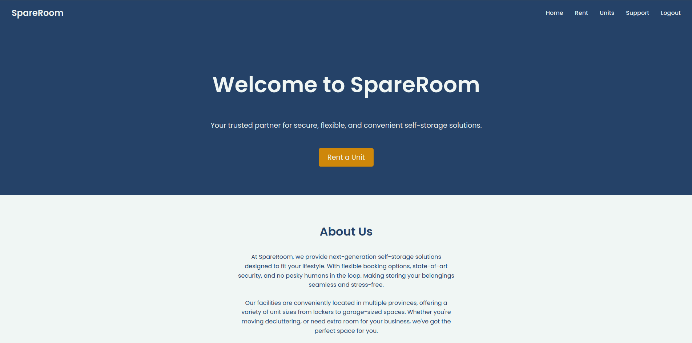

# EDA Storage Renting Site

This project is an **EDA (Event-Driven Architecture)** based storage-unit renting platform. The timeline for this project was 7 business days, from scratch. 
Users can rent storage units, browse available spaces, and manage their renting accounts efficiently through an online portal. The backend is built using a microservice architecture that follows event-driven principles, ensuring scalability and high responsiveness. The requests are handled by a REST API.

## Table of Contents
- [Backend Architecture](#backend-architecture)
- [Frontend](#frontend)
  - [Screenshots](#screenshots)
- [Technologies Used](#technologies-used)
- [Installation Guide](#installation-guide)
- [Usage](#usage)
- [API Endpoints](#api-endpoints)
- [License](#license)

## Backend Architecture

The backend architecture of this project follows an **Event-Driven** design to ensure that different components of the system are decoupled and can react to changes or events in real-time. Here's an overview of the system:
    - REST API
        -> /rent                       - Used to rent a unit
        -> /create_user                - Used to create a user 
        -> /units                      - Used to access and change unit information
        -> /notifications              - Used to get the notifications from a specific unit

 <!-- Replace with a link to your diagram -->

## Frontend

The frontend is designed with a user-friendly interface that lets customers browse storage units, make bookings, and manage their rental accounts.

### Screenshots:

#### Home Page
 <!-- Replace with a screenshot of the homepage -->

#### Storage Units Rented by Current User
 <!-- Replace with a screenshot of the browsing page -->

#### Unit Details
 <!-- Replace with a screenshot of the user profile page -->

#### Notifications Page
 <!-- Replace with a screenshot of the user profile page -->

#### Search Available Units
 <!-- Replace with a screenshot of the checkout page -->

#### Search Result of Available Units


## Technologies Used

- **Backend**:
  - Node.js, Express
  - Microservices (Docker, Kubernetes)
  - Kafka (for event bus)
  - MongoDB (for data storage)
  - Redis (for caching)
  - JWT (for user authentication)

- **Frontend**:
  - React.js
  - Material UI (for UI components)
  - Axios (for API calls)
  - React Router (for navigation)
  - Redux (for state management)

- **DevOps**:
  - Docker (for containerization)
  - Kubernetes (for orchestration)
  - GitHub Actions (for CI/CD)

## Installation Guide

To run the project locally, follow the steps below.

### Prerequisites:
- Node.js (v14 or higher)
- Docker
- MongoDB
- Kafka (for event-driven architecture)

### Step 1: Clone the repository

```bash
git clone https://github.com/your-username/storage-renting-site.git
cd storage-renting-site

